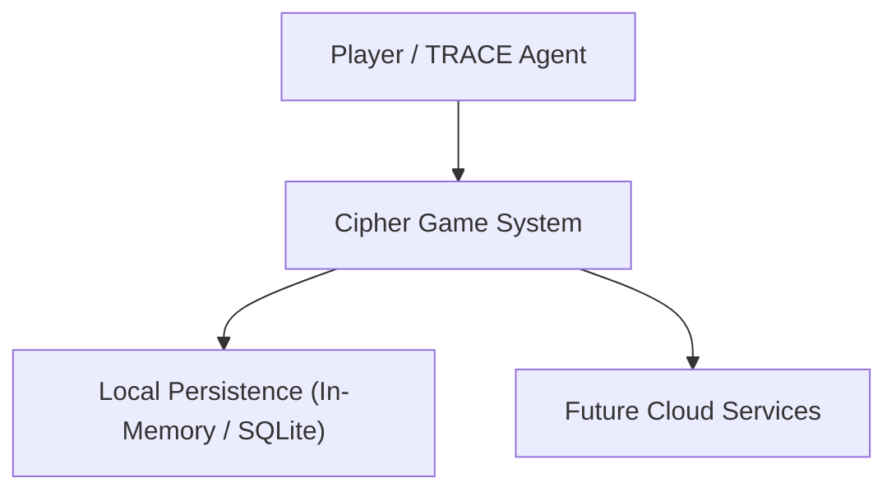
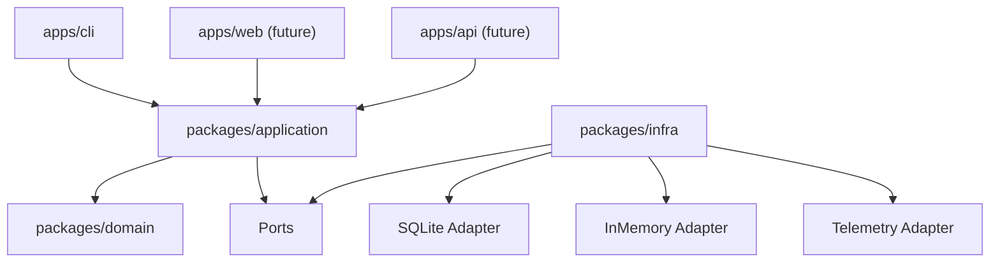
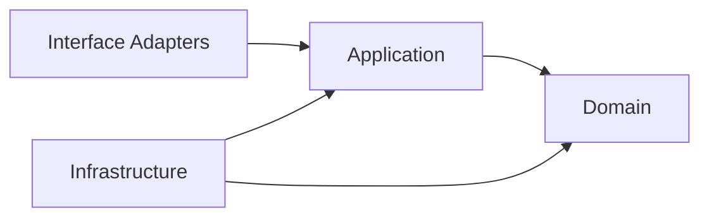
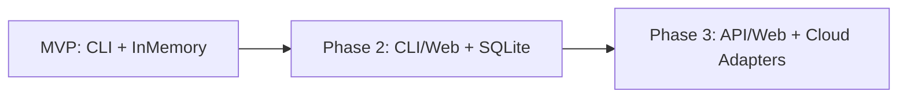

# C4 and Boundaries

## Proposito
Documentar visualmente el contexto del sistema, los contenedores principales y las fronteras de dependencia entre capas. Los diagramas aqui incluidos deben seguir siendo validos aunque cambien detalles de implementacion.

## Decisiones
### Contexto del sistema

### Contenedores

### Limites de dependencia

### Regla de importacion permitida
- `apps/*` puede depender de `packages/application` y contratos publicos.
- `packages/application` puede depender de `packages/domain`.
- `packages/infra` puede depender de `packages/application` y `packages/domain`.
- `packages/domain` no depende de ningun paquete interno ni externo fuera del lenguaje base.

### Diagrama de evolucion tecnica

## Implicaciones
- Los diagramas obligan a identificar interfaces antes de elegir herramientas.
- La evolucion a web y cloud queda modelada como reemplazo o adicion de adapters, no como reescritura del sistema.
- Si una dependencia propuesta no encaja en estos diagramas, debe justificarse con un ADR.

## Fuera de alcance
- Diagramas de despliegue detallado.
- Modelado de red o seguridad cloud temprana.
- Diagramas de componentes por framework.

## Concepto de ingenieria
El modelo `C4` captura arquitectura por niveles de zoom. En etapas tempranas conviene documentar contexto y contenedores, porque esos niveles sobreviven mejor al cambio que los diagramas de clases o archivos concretos.
