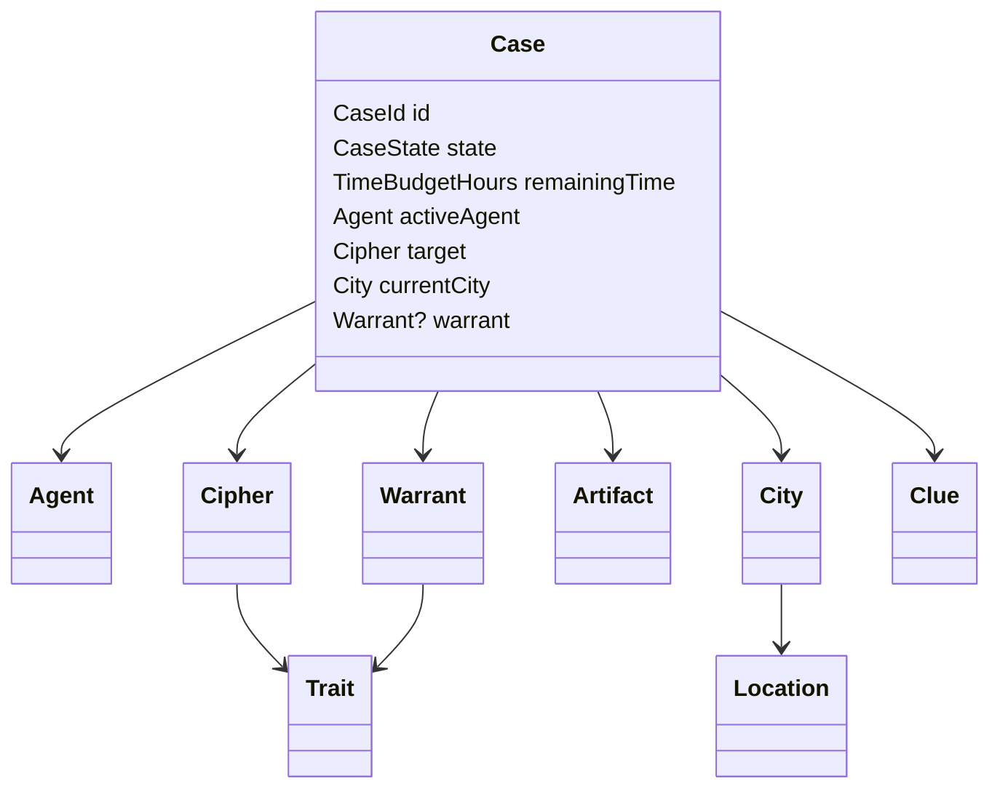

# Domain Model

## Proposito
Definir el modelo del dominio de `Cipher`: aggregate root, entidades, value objects, eventos, invariantes y relaciones principales. Este documento debe habilitar implementacion y testing sin reinterpretar las reglas del negocio.

## Decisiones
### Aggregate root
- `Case` es el `aggregate root`.
- Toda mutacion significativa del caso ocurre a traves de `Case`.
- `Case` encapsula:
  - ciudad actual del agente,
  - tiempo restante,
  - historial de viajes,
  - locaciones visitadas,
  - pistas recolectadas,
  - estado del caso,
  - warrant emitida,
  - resolucion final.

### Entidades
- `Case`
- `Cipher`
- `Agent`
- `City`
- `Location`
- `Artifact`

### Value Objects
- `CaseId`
- `CityId`
- `LocationId`
- `ClueId`
- `TimeBudgetHours`
- `Trait`
- `Warrant`
- `CaseState`

### Eventos de dominio
- `CaseOpened`
- `CityTraveled`
- `LocationVisited`
- `ClueCollected`
- `WarrantIssued`
- `CaseResolved`
- `CipherEscaped`

### Relaciones principales

### Invariantes
- Un `Case` solo tiene un `Cipher` objetivo.
- No se puede visitar una locacion si el caso no esta en `Investigating` o `Chase`.
- No se puede viajar si el tiempo restante es insuficiente para el costo de viaje.
- No se puede emitir una `Warrant` vacia.
- No se puede resolver un caso dos veces.
- Toda `Clue` recolectada debe estar asociada a una `Location` y a una `City`.
- El `Case` debe poder reconstruirse desde una `seed` y su historial de decisiones.

### Modelo de informacion de pistas
- `Route clue`: reduce el espacio de ciudades posibles.
- `Trait clue`: restringe rasgos de `Cipher`.
- `Noise clue`: agrega incertidumbre controlada.
- Toda pista debe incluir:
  - origen,
  - tipo,
  - contenido semantico,
  - confiabilidad,
  - relacion con la seed o con el generador.

### Puertos del dominio/aplicacion
- `CaseRepository`
- `RandomnessProvider`
- `Clock`
- `EventBus`
- `Telemetry`

## Implicaciones
- `Case` concentra consistencia y evita estados repartidos entre servicios externos.
- La granularidad de eventos debe ser suficiente para observabilidad, pero no tan alta que convierta cada setter en un evento.
- El modelado de `Trait` y `Warrant` es critico porque determina la dificultad legal de la captura.

## Fuera de alcance
- Modelado detallado de NPCs y dialogos.
- Inventario del detective.
- Economia de recursos aparte del tiempo.

## Concepto de ingenieria
En `DDD`, el `aggregate root` define el limite de consistencia. Elegir `Case` como raiz implica que las operaciones relevantes del juego deben poder validarse dentro de ese borde sin depender de coordinacion externa fragil.
