# Procedural Generation

## Proposito
Documentar como `Cipher` genera casos reproducibles, coherentes y resolubles. Este documento convierte la generacion procedural en un sistema verificable y no en una fuente opaca de contenido aleatorio.

## Decisiones
### Principios
- Toda generacion parte de una `seed`.
- Dada la misma `seed` y la misma version de reglas, el caso debe reconstruirse identicamente.
- El generador debe priorizar `solvencia` antes que variedad.
- El ruido permitido es limitado y controlado por dificultad.

### Pipeline de generacion

```mermaid
flowchart LR
    Seed["Seed"] --> Artifact["Select Artifact"]
    Artifact --> Route["Build Escape Route"]
    Route --> Cities["Assign Cities and Locations"]
    Cities --> Traits["Assign Cipher Traits"]
    Traits --> Clues["Plant Clues"]
    Clues --> Noise["Inject Controlled Noise"]
    Noise --> Validate["Validate Solvability"]
    Validate --> Case["Produce Case"]
```

### Pasos funcionales
1. Seleccionar `Artifact`.
2. Construir una ruta de escape de `Cipher`.
3. Seleccionar ciudades y locaciones consistentes con esa ruta.
4. Definir el perfil de rasgos requerido por la `Warrant`.
5. Sembrar `route clues` y `trait clues`.
6. Inyectar `noise clues` segun el tier del caso.
7. Ejecutar validadores de resolubilidad.
8. Emitir el `Case`.

### Garantias de resolubilidad
- Existe al menos una ruta correcta hasta la ciudad final.
- Existe evidencia suficiente para emitir una `Warrant` valida.
- El ruido no puede invalidar todas las pistas correctas de una rama critica.
- El presupuesto de tiempo base debe permitir resolver el caso con decisiones correctas.
- La solucion del caso debe poder explicarse con un trail de pistas.

### Modelo de ruido
- El ruido puede:
  - introducir ambiguedad leve,
  - apuntar a una ciudad secundaria plausible,
  - describir un rasgo incompleto o parcial.
- El ruido no puede:
  - contradecir todas las pistas verdaderas,
  - crear dos soluciones equivalentes sin criterio de desempate,
  - exigir conocimiento externo al juego.

### Escalado de dificultad
- `Tier 1`: linea casi directa, bajo ruido.
- `Tier 2`: mas nodos y mayores costos de viaje.
- `Tier 3`: mas ramas plausibles y mas rasgos requeridos.
- `Tier 4+`: mas densidad informativa, pero siempre con trail verificable.

### Validadores requeridos
- `RouteValidator`
- `WarrantEvidenceValidator`
- `TimeBudgetValidator`
- `NoiseBudgetValidator`
- `DeterminismValidator`

## Implicaciones
- El generador debe separarse en funciones puras y pasos validables.
- Las reglas de dificultad dependen tanto del generador como del modelo de dominio.
- Los casos defectuosos deben fallar en validacion, no llegar al jugador.

## Fuera de alcance
- Generacion asistida por IA en runtime.
- Contenido infinito no determinista.
- Herramienta de authoring visual en esta fase.

## Concepto de ingenieria
La generacion procedural confiable se beneficia de `FP`: funciones puras, composicion y validacion posterior. Esto permite testear propiedades del sistema, no solo ejemplos puntuales, y controlar mejor el efecto de la aleatoriedad.
