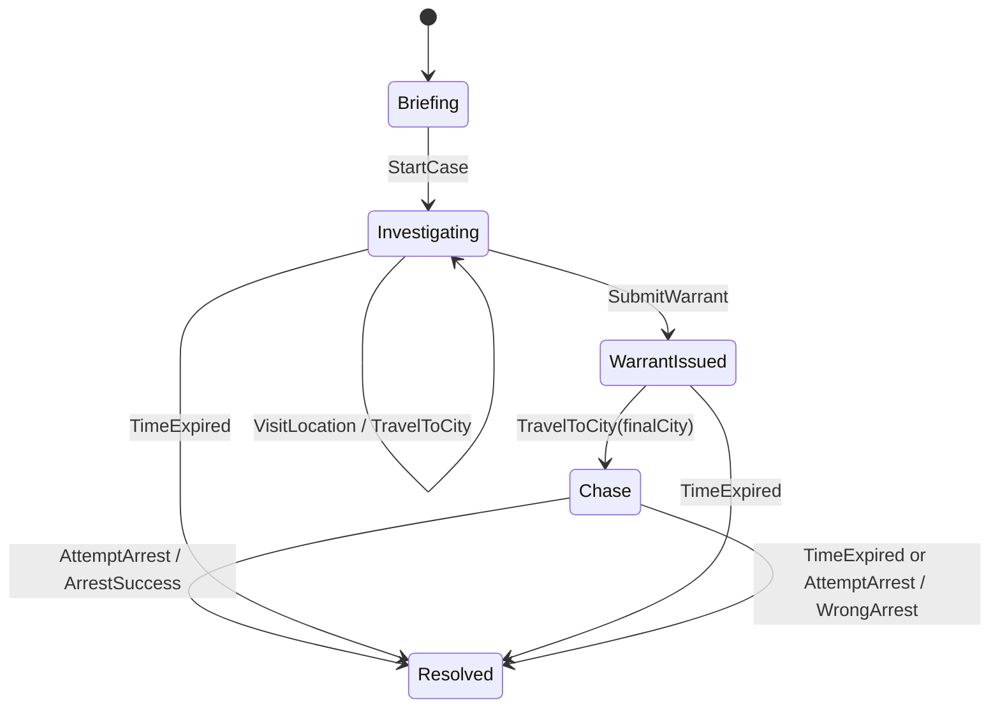

# State Machine

## Proposito
Formalizar los estados del `Case`, sus transiciones permitidas y las reglas que bloquean cambios invalidos. Este documento evita que el flujo del juego quede implcito en condicionales dispersos.

## Decisiones
### Estados canonicos
- `Briefing`
- `Investigating`
- `WarrantIssued`
- `Chase`
- `Resolved`

### Transiciones permitidas

### Reglas por estado
#### Briefing
- Existe el caso, pero aun no comenzo la operacion.
- Se permite inspeccionar el contexto inicial.
- No se permiten viajes ni visitas.

#### Investigating
- Se permiten `TravelToCity` y `VisitLocation`.
- Se acumulan pistas y se consume tiempo.
- La `Warrant` aun no fue emitida.

#### WarrantIssued
- El jugador ya comprometio una hipotesis sobre `Cipher`.
- Se puede continuar desplazamiento hacia la ciudad final.
- Reemitir la warrant solo se permite si el diseno posterior lo aprueba; por defecto, no.

#### Chase
- El caso entra en persecucion final.
- El tiempo restante y la ciudad objetivo se vuelven determinantes.

#### Resolved
- El caso es terminal.
- No se aceptan nuevas mutaciones.
- Debe registrar resultado y causa de cierre.

### Tabla de comandos por estado
| Comando | Briefing | Investigating | WarrantIssued | Chase | Resolved |
|---|---|---|---|---|---|
| `StartCase` | si | no | no | no | no |
| `TravelToCity` | no | si | si | si | no |
| `VisitLocation` | no | si | no | opcional | no |
| `SubmitWarrant` | no | si | no | no | no |
| `AttemptArrest` | no | no | no | si | no |
| `GetCaseStatus` | si | si | si | si | si |

## Implicaciones
- El estado debe ser un `Value Object` o enumeracion controlada, no un string libre.
- Cada caso de uso tiene precondiciones explicitas.
- El testing debe cubrir tanto transiciones felices como intentos invalidos.

## Fuera de alcance
- Maquinas de estado separadas para UI.
- Estado de menus, overlays o navegacion web.
- Historias paralelas o ramas narrativas cinematicas.

## Concepto de ingenieria
Una `state machine` convierte reglas secuenciales implcitas en un contrato formal. Eso reduce bugs por orden de operaciones y facilita modelar precondiciones en use cases y tests.
