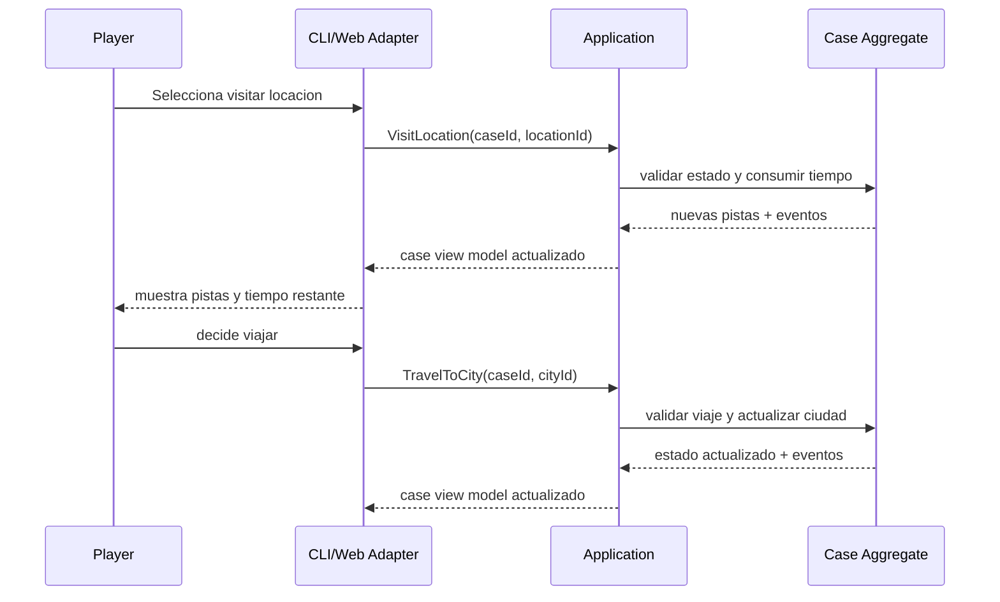

# Core Loop and Progression

## Proposito
Aislar el loop central, subloops y la progresion del juego para que las decisiones de producto y dominio no queden dispersas entre brief, GDD y arquitectura.

## Decisiones
### Loop principal
1. Recibir `Briefing`.
2. Evaluar la ciudad actual y las acciones disponibles.
3. `VisitLocation` para obtener nuevas `Clues`.
4. Interpretar pistas de ruta y rasgos.
5. `TravelToCity` consumiendo tiempo.
6. Repetir hasta identificar ciudad final y rasgos de `Cipher`.
7. `SubmitWarrant`.
8. `AttemptArrest`.
9. Resolver captura o escape.

### Secuencia del loop de investigacion

### Subloops
#### Loop de investigacion
- Seleccionar la locacion con mejor relacion costo/informacion.
- Obtener pistas.
- Actualizar hipotesis sobre ciudad siguiente y rasgos del objetivo.

#### Loop de navegacion
- Comparar costo temporal del viaje con el valor esperado de la ciudad destino.
- Decidir si seguir una pista principal o validar una hipotesis secundaria.

#### Loop de deduccion
- Consolidar `Trait clues`.
- Determinar si la evidencia es suficiente para emitir la `Warrant`.
- Gestionar riesgo: emitir demasiado pronto puede invalidar la captura; emitir demasiado tarde puede agotar el tiempo.

### Progresion de caso
- `Case tier 1`: grafo pequeno, ruido minimo, pocos rasgos.
- `Case tier 2`: mas bifurcaciones y costos de viaje mas relevantes.
- `Case tier 3`: mas ruido, rutas enganosas limitadas y mayor densidad de rasgos.
- `Case tier 4+`: `Cipher` introduce patrones mas complejos, pero siempre bajo garantias de resolubilidad.

### Progresion del jugador
- Aprende a leer el sistema, no solo a memorizar contenido.
- La maestria se mide por:
  - calidad de deduccion,
  - eficiencia temporal,
  - consistencia en la seleccion de locaciones,
  - uso disciplinado de la `Warrant`.

### Progresion del antagonista
- `Cipher` no sube solo en numeros.
- Aumenta la complejidad por:
  - patrones de movimiento menos triviales,
  - artefactos con contexto geografico mas ambiguo,
  - mezcla mas rica de clues de ruta y rasgos,
  - ventanas temporales mas tensas.

### Reglas de justicia
- Nunca se debe exigir una deduccion imposible.
- El ruido debe generar incertidumbre razonable, no adivinacion.
- Siempre debe existir una secuencia resoluble si el jugador interpreta correctamente la informacion.

## Implicaciones
- El loop principal exige un modelo de estado claro y comandos discretos.
- La progresion debe documentarse junto al generador procedural, porque dificultad y generacion no son sistemas independientes.
- La UX del CLI debe ayudar a sintetizar informacion para que el desafio sea de decision, no de parsing visual.

## Fuera de alcance
- Arboles de progresion RPG.
- Equipamiento del detective.
- Modo sandbox sin limite de tiempo.
- Eventos meta fuera del caso actual.

## Concepto de ingenieria
Separar `core loop`, `subloops` y `progression` evita mezclar reglas tacticas con escalado sistemico. Esto ayuda a mapear responsabilidades a casos de uso, servicios de dominio y parametros de generacion sin duplicar logica.
